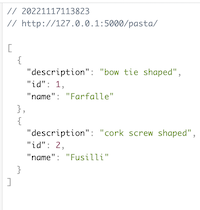

# Pasta API

## Model/Schema

```
class BaseModel(Model):
    class Meta:
        database = db

class Pasta(BaseModel):
    name = CharField()
    description = CharField()
```

A dataset written in Python, SQL and Flask. Has Create, Read and Delete operations.

## Dependencies

Peewee, Flask


